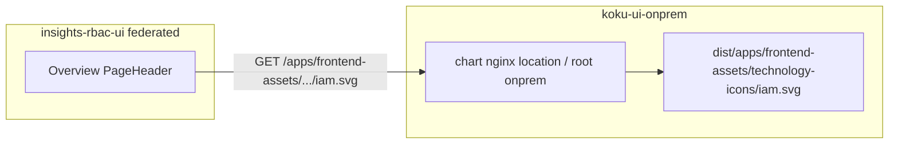

# Fix overview `iam.svg` on on-prem host

## Context (from [prior session](f812a6b9-21b5-4dda-b0d9-17453197970c))

User Access **Overview** shows a broken image because federated RBAC hardcodes a platform URL the on-prem host never served:

```33:33:submodules/insights-rbac-ui/src/shared/components/overview/Overview.tsx
        icon={}
```

[`VISUAL_SIGNOFF.md`](pipelines/rpi/v1/stages/40-verify/output/flpath-4164/visual-compare/VISUAL_SIGNOFF.md) records **option 1** (host static at that path) as the recommended post-POC fix. Options 2 (`/rbac/` only) and 3 (upstream URL config) are poor fits because the `` is absolute and outside `/rbac/`, and upstream edits are out of scope for FLPATH-4164.

The canonical asset is live on SaaS: `https://console.redhat.com/apps/frontend-assets/technology-icons/iam.svg` (HTTP 200, Red Hat IAM technology icon SVG).



## Implementation (koku-ui submodule)

**Branch:** [`submodules/koku-ui`](submodules/koku-ui) on existing `feat/flpath-4164` (per [submodule-git-workflow](.cursor/rules/submodule-git-workflow.mdc)).

### 1. Vendor the SVG

- Add [`submodules/koku-ui/apps/koku-ui-onprem/src/assets/technology-icons/iam.svg`](submodules/koku-ui/apps/koku-ui-onprem/src/assets/technology-icons/iam.svg) by copying the production file from `console.redhat.com` (same bytes SaaS serves).
- Keep path structure aligned with HCC: `src/assets/technology-icons/` mirrors the URL segment after `/apps/frontend-assets/`.

### 2. Emit into host `dist` at the exact URL path

Update [`submodules/koku-ui/apps/koku-ui-onprem/webpack.config.ts`](submodules/koku-ui/apps/koku-ui-onprem/webpack.config.ts):

- Import `CopyWebpackPlugin` (already a workspace dependency in root [`package.json`](submodules/koku-ui/package.json)).
- Add plugin pattern:

```ts
new CopyWebpackPlugin({
  patterns: [
    {
      from: path.resolve(__dirname, 'src/assets/technology-icons'),
      to: path.resolve(__dirname, 'dist/apps/frontend-assets/technology-icons'),
    },
  ],
}),
```

**Why host, not `rbac-ui-onprem`:** Production layout copies remotes under `/rbac/`, `/costManagement/`, etc. ([`Containerfile`](submodules/koku-ui/apps/koku-ui-onprem/Containerfile), [`nginx-config.yaml`](submodules/cost-onprem-chart/cost-onprem/templates/ui/nginx-config.yaml)). Only the host `onprem` tree is rooted at `/`, so `dist/apps/frontend-assets/...` is served without chart changes.

**Dev server:** Existing `devServer.static` entry for `koku-ui-onprem/dist` will serve the copied file after webpack emits it; no chart/nginx edit required.

### 3. Verification

| Step | Command / check |
|------|------------------|
| Local build | `cd submodules/koku-ui && npm run -w @koku-ui/koku-ui-onprem build` then `test -f apps/koku-ui-onprem/dist/apps/frontend-assets/technology-icons/iam.svg` |
| Local HTTP | With `start:onprem`, `curl -sI http://localhost:9001/apps/frontend-assets/technology-icons/iam.svg` → `200` + `image/svg+xml` |
| Cypress | Extend [`04-iam-storybook-parity.cy.ts`](submodules/koku-ui/apps/koku-ui-onprem/cypress/e2e/live/04-iam-storybook-parity.cy.ts) `parity-overview`: after `h1` visible, assert `img.rbac-overview-icon` has `naturalWidth > 0` (or intercept GET and expect 200) |
| Full on-prem gate | `npm run verify:onprem` (unchanged script; ensures build still passes) |
| Cluster (optional) | Rebuild/push image tag **rc20+**, hit `/iam/user-access/overview`, refresh [`visual-compare/cluster/01-overview.png`](pipelines/rpi/v1/stages/40-verify/output/flpath-4164/visual-compare/cluster/01-overview.png) |

### 4. Workspace docs (after code is green)

Update pipeline/wiki artifacts (no upstream submodule edits):

- [`VISUAL_SIGNOFF.md`](pipelines/rpi/v1/stages/40-verify/output/flpath-4164/visual-compare/VISUAL_SIGNOFF.md) — mark **OV** fixed; note host asset path
- [`VERIFICATION.md`](pipelines/rpi/v1/stages/40-verify/output/flpath-4164/VERIFICATION.md) — close overview-icon open item
- [`PLAN.md`](pipelines/rpi/v1/stages/20-plan/output/flpath-4164/PLAN.md) Phase 9 row for **OV** → done
- [`wiki/entities/flpath-4164-rbac-mfe-poc.md`](wiki/entities/flpath-4164-rbac-mfe-poc.md) + [`wiki/log.md`](wiki/log.md)

Superproject: bump `submodules/koku-ui` gitlink when submodule commit is ready (user-approved commit only).

## Out of scope (unless you want them in the same pass)

- **`insights.svg`** for `WorkspacesOverview` / `AssetsCards` — same pattern, different route; not on the five-route POC checklist
- **Upstream** configurable icon URL in `insights-rbac-ui`
- **Chart nginx** new `location` block (unnecessary if file lives under `onprem/dist`)

## Risk / constraints

- **Licensing:** Asset is Red Hat brand technology icon; vendoring for on-prem parity with SaaS is consistent with existing console usage.
- **No `insights-rbac-ui` changes** — keeps FLPATH-4164 boundary intact.
- **Image tag:** Cluster fix requires rebuilding `koku-ui-onprem` image; local webpack verify is sufficient for code review before push.
