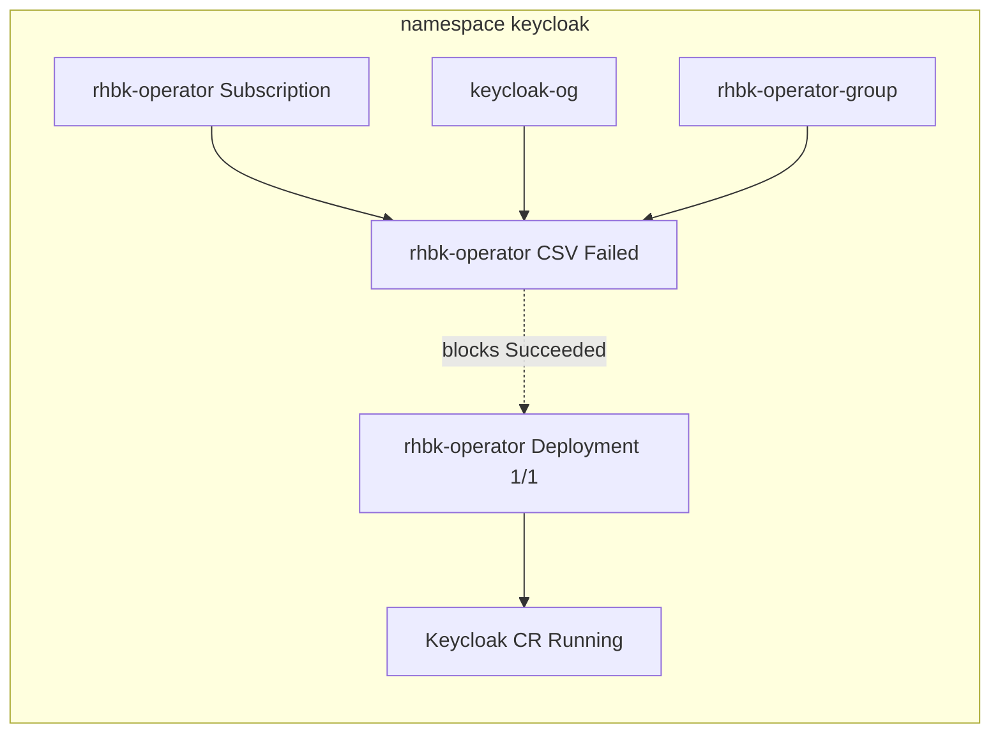

# Fix RHBK CSV Failed (TooManyOperatorGroups)

## Root cause (confirmed on cluster)


| Field       | Value                                                                                 |
| ----------- | ------------------------------------------------------------------------------------- |
| CSV         | `rhbk-operator.v26.4.11-opr.2` in namespace `keycloak`                                |
| Phase       | `Failed`                                                                              |
| **reason**  | `TooManyOperatorGroups`                                                               |
| **message** | `csv created in namespace with multiple operatorgroups, can't pick one automatically` |


Two OperatorGroups exist in `keycloak`:


| Name                  | Created    | Origin (likely)                                                                                                                                               |
| --------------------- | ---------- | ------------------------------------------------------------------------------------------------------------------------------------------------------------- |
| `keycloak-og`         | 2026-05-06 | OLM / console install (has `olm.providedAPIs` annotation)                                                                                                     |
| `rhbk-operator-group` | 2026-05-10 | `[deploy-rhbk.sh](submodules/cost-onprem-chart/scripts/deploy-rhbk.sh)` — created because the script only checks for **that name**, not “any OG in namespace” |


Both have identical specs (`targetNamespaces: [keycloak]`).




**Historical noise:** CSV conditions also show past `ComponentUnhealthy` / `InstallWaiting` when `rhbk-operator` deployment was briefly unavailable. That is **no longer the problem** — deployment is `1/1` Available as of today.

**Workloads are not down:** `keycloak-0`, `rhbk-operator-`*, and realm import jobs are Running/Completed. The Failed CSV is an **OLM reconciliation** issue, not a crashed operator.

## Non-disruptive fix (cluster)

**Goal:** One OperatorGroup in `keycloak`. Keep the original; remove the duplicate added by the script.

1. **Confirm state** (read-only):

```bash
oc get operatorgroup -n keycloak
oc get csv rhbk-operator.v26.4.11-opr.2 -n keycloak -o jsonpath='{.status.reason}{"\n"}{.status.message}{"\n"}'
oc get deployment rhbk-operator -n keycloak
```

1. **Delete only the duplicate OperatorGroup** (does **not** delete Subscription, CSV object, Deployment, Keycloak CR, or pods):

```bash
oc delete operatorgroup rhbk-operator-group -n keycloak
```

Do **not** delete `keycloak-og` — it is the OG OLM created with the first install.

1. **Wait for OLM to reconcile** (~1–2 minutes):

```bash
watch -n5 'oc get csv rhbk-operator.v26.4.11-opr.2 -n keycloak; oc get operatorgroup -n keycloak'
```

Expected: CSV phase moves from `Failed` → `Installing` → `Succeeded`; `keycloak-og` should lose `MultipleOperatorGroupsFound` on its status.

1. **If CSV stays Failed** (uncommon after OG fix):

- Re-check `oc get csv ... -o jsonpath='{.status.reason}'` — should no longer be `TooManyOperatorGroups`.
- Do **not** delete the Subscription or Keycloak CR unless a new error appears.
- Last resort (still low impact if operator pod stays up): delete only the CSV object and let OLM recreate it from the existing InstallPlan — only if Red Hat/OLM docs for your version recommend it; usually unnecessary here.

**Risk profile:** Low. Removing an extra OG does not roll the operator Deployment or Keycloak StatefulSet. AMQ Streams in this cluster uses `openshift-operators`, not this duplicate OG.

## Prevention (repo change — include in execution)

`[deploy-rhbk.sh](submodules/cost-onprem-chart/scripts/deploy-rhbk.sh)` lines 237–253 should mirror `[deploy-kafka.sh](submodules/cost-onprem-chart/scripts/deploy-kafka.sh)` (lines 273–283): create an OperatorGroup **only if the namespace has none**, not only if `rhbk-operator-group` is missing.

Proposed logic:

```bash
if ! oc get operatorgroup -n "$NAMESPACE" --no-headers 2>/dev/null | grep -q .; then
  # create rhbk-operator-group
else
  echo_success "✓ OperatorGroup already exists in $NAMESPACE (skipping create)"
fi
```

The script’s `cleanup` already deletes `rhbk-operator-group` only — acceptable if the duplicate was created by the script; document that manual/console installs may leave `keycloak-og` behind.

## Verification checklist

After deleting `rhbk-operator-group`:

- `oc get csv rhbk-operator.v26.4.11-opr.2 -n keycloak` → `PHASE=Succeeded`
- `oc get operatorgroup -n keycloak` → single row (`keycloak-og`)
- `oc get deployment rhbk-operator -n keycloak` → still `1/1`
- `oc get keycloak keycloak -n keycloak` → unchanged / Ready
- SSO still works: token URL used by on-prem UI (e.g. `sso.apps.<leased-cluster>...`) still issues tokens

## Wiki capture (required — for later sessions)

Follow [`llm-wiki.mdc`](.cursor/rules/llm-wiki.mdc): durable facts, symptoms, fix commands, and prevention — not only chat.

### New page

Create [`wiki/entities/known-issue-rhbk-csv-too-many-operatorgroups.md`](wiki/entities/known-issue-rhbk-csv-too-many-operatorgroups.md) (same pattern as [`known-issue-keycloak-declarative-profile-jwt.md`](wiki/entities/known-issue-keycloak-declarative-profile-jwt.md)):

| Section | Content |
|---------|---------|
| **Symptom** | `oc get csv -n keycloak` shows `rhbk-operator.v*.*` **Failed**; `status.reason=TooManyOperatorGroups`; message about multiple operatorgroups. Keycloak/operator pods may still be **Running** — SSO can work while CSV is Failed. |
| **Diagnosis** | `oc get operatorgroup -n keycloak` → **two** rows (e.g. `keycloak-og` + `rhbk-operator-group`). Confirm: `oc get csv rhbk-operator.v26.4.11-opr.2 -n keycloak -o jsonpath='{.status.reason}{"\n"}'`. |
| **Root cause** | Console/OLM install created one OperatorGroup; [`deploy-rhbk.sh`](submodules/cost-onprem-chart/scripts/deploy-rhbk.sh) added a second because it only checks for `rhbk-operator-group` by name, not “any OG in namespace”. |
| **Fix (non-disruptive)** | Delete the **duplicate** OG (typically `rhbk-operator-group`); **keep** the original (e.g. `keycloak-og` with `olm.providedAPIs`). Full commands from [Non-disruptive fix](#non-disruptive-fix-cluster) above. |
| **Verify** | Single OG; CSV `Succeeded`; `rhbk-operator` deployment still `1/1`; Keycloak CR unchanged. |
| **Prevention** | `deploy-rhbk.sh` OG guard aligned with `deploy-kafka.sh` (create OG only if namespace has none). |
| **Related** | Link to [demo-catalog-cost-onprem-install](wiki/entities/demo-catalog-cost-onprem-install.md) RHBK section. |

### Index and cross-links

1. **[`wiki/index.md`](wiki/index.md)** — add Entities row for the new known-issue page.
2. **[`wiki/entities/demo-catalog-cost-onprem-install.md`](wiki/entities/demo-catalog-cost-onprem-install.md)** — under **RHBK** section, add bullet: CSV **Failed** / duplicate OperatorGroup → link to new page.
3. **[`wiki/log.md`](wiki/log.md)** — append: `## [2026-05-18] ingest | RHBK CSV TooManyOperatorGroups known issue`

### Optional skill touch

If [`cost-onprem-chart-install/SKILL.md`](.cursor/skills/cost-onprem-chart-install/SKILL.md) has an RHBK troubleshooting section, add one line pointing at the wiki page (only if that section already exists — avoid scope creep).