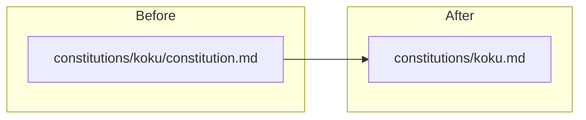

# Flatten constitutions folder hierarchy

## Current vs target layout

**Today** (5 files, 5 empty-capable subdirs):

```text
constitutions/
├── cost-onprem-chart/constitution.md
├── insights-rbac-ui/constitution.md
├── koku/constitution.md
├── koku-ui/constitution.md
└── sources-ui/constitution.md
```

**After** (flat, filename = submodule name):

```text
constitutions/
├── cost-onprem-chart.md
├── insights-rbac-ui.md
├── koku.md
├── koku-ui.md
└── sources-ui.md
```

Use `git mv` (or equivalent) so history follows the rename. Delete the now-empty `constitutions/<name>/` directories.



## File moves (one per submodule)

| From | To |
|------|-----|
| [`constitutions/cost-onprem-chart/constitution.md`](constitutions/cost-onprem-chart/constitution.md) | `constitutions/cost-onprem-chart.md` |
| [`constitutions/insights-rbac-ui/constitution.md`](constitutions/insights-rbac-ui/constitution.md) | `constitutions/insights-rbac-ui.md` |
| [`constitutions/koku/constitution.md`](constitutions/koku/constitution.md) | `constitutions/koku.md` |
| [`constitutions/koku-ui/constitution.md`](constitutions/koku-ui/constitution.md) | `constitutions/koku-ui.md` |
| [`constitutions/sources-ui/constitution.md`](constitutions/sources-ui/constitution.md) | `constitutions/sources-ui.md` |

**Content:** Keep each file’s body and `# … — constitution` heading unchanged unless a link inside the file must be fixed.

**Internal cross-link** in [`constitutions/koku-ui/constitution.md`](constitutions/koku-ui/constitution.md) (line 21):

- Old: `` [`constitutions/sources-ui/`](../sources-ui/constitution.md) ``
- New: `` [`constitutions/sources-ui.md`](sources-ui.md) `` (same-directory relative link after flattening)

## Normative path updates

Replace `constitutions/<name>/constitution.md` with `constitutions/<name>.md` and `constitutions/<name>/` with `constitutions/<name>.md` (or `constitutions/` where listing the folder is enough).

| File | Change |
|------|--------|
| [`.cursor/rules/workspace-workflow.mdc`](.cursor/rules/workspace-workflow.mdc) | Mission context line 40 |
| [`.cursor/rules/submodule-git-workflow.mdc`](.cursor/rules/submodule-git-workflow.mdc) | Exceptions line 23 |
| [`AGENTS.md`](AGENTS.md) | Routing table: `constitutions/<name>/` → `constitutions/<name>.md`; optional one-line note in folder-structure block that files are flat `*.md` |
| [`wiki/entities/sources-ui-reference.md`](wiki/entities/sources-ui-reference.md) | Constitution link → `../../constitutions/sources-ui.md` |

**Docs** (folder link stays valid; no path change required unless you want an explicit example):

- [`docs/README.md`](docs/README.md) — table row already points at `constitutions/`; optional add “one `<submodule>.md` per checkout”
- [`docs/architecture/c4/repository-map.md`](docs/architecture/c4/repository-map.md) — line 17 `constitutions/` link remains correct

**Historical plans** (optional, low priority per [`AGENTS.md`](AGENTS.md) “prefer wiki entities”):

- [`.cursor/plans/c4_system_documentation_5b82e4e2.plan.md`](.cursor/plans/c4_system_documentation_5b82e4e2.plan.md) — update repo-mapping link if touched

Do **not** rewrite [`wiki/log.md`](wiki/log.md) historical entries; append a new log line after the change (see wiki step below).

## Verification

After edits, run a repo-wide search (read-only) and expect **zero** hits for nested paths:

```bash
rg 'constitutions/[^/]+/constitution\.md' --glob '!wiki/log.md'
```

Confirm all five flat files exist and no `constitutions/*/constitution.md` paths remain.

## Wiki maintenance (per [`.cursor/rules/llm-wiki.mdc`](.cursor/rules/llm-wiki.mdc))

Append to [`wiki/log.md`](wiki/log.md):

`## [2026-05-22] update | Flatten constitutions to constitutions/<submodule>.md`

No new index row required unless you add a dedicated topic page; [`wiki/workspace/overview.md`](wiki/workspace/overview.md) can stay generic (“per-submodule constitutions”).

## Ready-to-commit state

Per [no-auto-commit](.cursor/rules): stop with `git status` summary and proposed message, e.g.:

> Flatten constitutions layout to one markdown file per submodule.

User approves before any commit.
