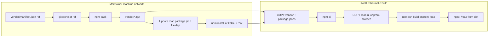

# Konflux-ready RBAC vendor (npm pack + devDependency)

## Problem

The current approach commits pre-built federated output under [`apps/rbac-ui-onprem/vendor/`](submodules/koku-ui/apps/rbac-ui-onprem/vendor/) and special-cases the Containerfile (copy static `rbac-static` without webpack). Konflux needs **upstream sources available at clone time** and a normal **`npm ci` + MFE webpack** flow—same as HCCM/ROS/Sources.

## Decisions (from interview)

| Topic | Choice |
|-------|--------|
| Committed artifact | `npm pack` `.tgz` under **`koku-ui/vendor/`** |
| Pin source of truth | [`koku-ui/vendor/manifest.json`](submodules/koku-ui/vendor/manifest.json) — `{ repo, ref }` only |
| Tarball name | `insights-rbac-ui@<full-sha>.tgz` |
| Old tarballs | Vendor script deletes other `insights-rbac-ui@*.tgz` in `vendor/` |
| devDependency | **`apps/rbac-ui-onprem/package.json` only**: `insights-rbac-frontend: file:../../vendor/insights-rbac-ui@<full-sha>.tgz` |
| Committed dist | **No** — remove `apps/rbac-ui-onprem/vendor/**/dist` |
| Pack prep | Clone/checkout at ref → **`npm pack` immediately** (no upstream `npm ci`) |
| verify.sh | **Remove** — npm install + manifest ref are sufficient |
| Vendor scripts | Keep [`apps/rbac-ui-onprem/scripts/`](submodules/koku-ui/apps/rbac-ui-onprem/scripts/), paths adapted to `../../vendor/` |
| Containerfile | RBAC built **like other MFEs**: `COPY` app → `npm run build:onprem -w @koku-ui/rbac-ui-onprem` → copy `apps/rbac-ui-onprem/dist` to nginx `./rbac` |

## Target layout

```text
koku-ui/
├── vendor/
│   ├── manifest.json          # { "repo": "https://github.com/...", "ref": "<full-sha>" }
│   └── insights-rbac-ui@<full-sha>.tgz
├── package-lock.json          # records file: tarball resolution (committed on bump)
└── apps/rbac-ui-onprem/
    ├── package.json           # devDependencies.insights-rbac-frontend: file:../../vendor/...
    ├── scripts/               # vendor.sh, build.sh, start.sh, lib.sh (no verify.sh)
    └── dist/                  # gitignored; produced by webpack locally / in CI
```

**Remove:** [`apps/rbac-ui-onprem/rbac-ui.version.json`](submodules/koku-ui/apps/rbac-ui-onprem/rbac-ui.version.json), entire [`apps/rbac-ui-onprem/vendor/`](submodules/koku-ui/apps/rbac-ui-onprem/vendor/) tree (large dist blobs).

## Data flow



## 1. Add `koku-ui/vendor/manifest.json`

Minimal SoT (example):

```json
{
  "repo": "https://github.com/RedHatInsights/insights-rbac-ui.git",
  "ref": "b4ca374603344a60ea3260433a4c913f1ff93ae3"
}
```

Bump workflow: edit `ref` in manifest → run `npm run vendor -w @koku-ui/rbac-ui-onprem` → commit `manifest.json`, tarball, `apps/rbac-ui-onprem/package.json`, and **`package-lock.json`**.

## 2. Rewrite `vendor.sh` (pack + link, no webpack)

Replace current 9-stage dist pipeline with ~6 stages:

1. **Read pin** — `vendor/manifest.json` (`repo`, `ref`); derive `TGZ_NAME=insights-rbac-ui@${ref}.tgz`, `TGZ_PATH=$KOKU_UI_ROOT/vendor/$TGZ_NAME`
2. **Acquire source** — `git clone` + `checkout $ref` to `$TMPDIR` (or `RBAC_SRC` if HEAD matches `ref`)
3. **Pack** — `(cd $clone && npm pack)` → move resulting `.tgz` to `vendor/$TGZ_NAME` (handle npm’s default `insights-rbac-frontend-*.tgz` rename if needed)
4. **Prune** — delete other `vendor/insights-rbac-ui@*.tgz`
5. **Link** — update [`apps/rbac-ui-onprem/package.json`](submodules/koku-ui/apps/rbac-ui-onprem/package.json):
   ```json
   "insights-rbac-frontend": "file:../../vendor/insights-rbac-ui@<full-sha>.tgz"
   ```
   then from `KOKU_UI_ROOT`: `npm install` (or `npm install -w @koku-ui/rbac-ui-onprem`) to refresh **committed** lockfile
6. **Complete** — log paths to commit; no `dist/` publish

**Remove from vendor.sh:** symlink-only link, `REBUILD_RBAC` webpack, dist move, `rbac-ui.build.json`, transient cleanup helpers tied to no-save installs.

Keep colored logging and `EXIT` trap (temp clone cleanup only).

## 3. Restore devDependency model in `lib.sh` / `build.sh` / `start.sh`

- **[`lib.sh`](submodules/koku-ui/apps/rbac-ui-onprem/scripts/lib.sh):** Replace `VERSION_FILE` / `rbac_vendor_dist_present()` with helpers reading `vendor/manifest.json` and resolving tarball path (for optional logging only).
- **[`build.sh`](submodules/koku-ui/apps/rbac-ui-onprem/scripts/build.sh):** Always run webpack (remove vendored-dist skip). Requires `insights-rbac-frontend` installed via `npm ci`.
- **[`start.sh`](submodules/koku-ui/apps/rbac-ui-onprem/scripts/start.sh):** Always `webpack --watch` (remove `tail -f /dev/null` vendored idle path).
- **Delete [`verify.sh`](submodules/koku-ui/apps/rbac-ui-onprem/scripts/verify.sh)** and remove from [`package.json`](submodules/koku-ui/apps/rbac-ui-onprem/package.json):
  - `verify:onprem` script
  - `prebuild:onprem` hook that called verify

## 4. Align Containerfile with other MFEs

Update [`apps/koku-ui-onprem/Containerfile`](submodules/koku-ui/apps/koku-ui-onprem/Containerfile):

**Early layer (with other `package.json` copies):**
- `COPY vendor ./vendor` (manifest + `.tgz`)
- Drop `COPY apps/rbac-ui-onprem/rbac-ui.version.json`, `COPY apps/rbac-ui-onprem/vendor`, `RUN verify.sh`, and the `rbac-static` node copy block

**After `npm ci`:**
- `COPY apps/rbac-ui-onprem ./apps/rbac-ui-onprem/`
- `RUN npm run build:onprem --workspace=@koku-ui/rbac-ui-onprem` (same pattern as HCCM/ROS/Sources)

**Final nginx stage:**
- Replace `COPY --from=builder /app/rbac-static ./rbac` with `COPY --from=builder /app/apps/rbac-ui-onprem/dist ./rbac`

## 5. Host dev server (`koku-ui-onprem` webpack)

Simplify [`apps/koku-ui-onprem/webpack.config.ts`](submodules/koku-ui/apps/koku-ui-onprem/webpack.config.ts) `resolveRbacStaticDirectory()`:

- Serve **`../rbac-ui-onprem/dist`** only (built output)
- Remove `vendorDir` / `rbac-ui.version.json` branching and vendored-dist watch logic

Developers: `npm ci` then `npm run start:onprem:dev` (RBAC slot runs webpack watch like before the dist-vendor shortcut).

## 6. `.gitignore` and repo hygiene

- Add `apps/rbac-ui-onprem/dist/` to [`koku-ui/.gitignore`](submodules/koku-ui/.gitignore) if not already ignored
- Delete committed `apps/rbac-ui-onprem/vendor/**` (large binary removal in PR)
- Ensure `koku-ui/vendor/*.tgz` is **tracked** (not gitignored)

## 7. Docs / wiki

Update:

- [`apps/rbac-ui-onprem/README.md`](submodules/koku-ui/apps/rbac-ui-onprem/README.md)
- [`wiki/topics/rbac-ui-onprem-vendor.md`](wiki/topics/rbac-ui-onprem-vendor.md)
- [`wiki/entities/flpath-4164-rbac-mfe-poc.md`](wiki/entities/flpath-4164-rbac-mfe-poc.md) — Konflux story: committed pack + lockfile, webpack in image
- [`wiki/log.md`](wiki/log.md) — one-line ingest entry

Remove references to `rbac-ui.version.json`, committed federated dist, and `verify-onprem-rbac`.

## 8. Verification (manual)

| Step | Command | Expected |
|------|---------|----------|
| Pack bump | Edit `vendor/manifest.json` ref → `npm run vendor -w @koku-ui/rbac-ui-onprem` | New `.tgz`, updated `package.json` + lockfile, no temp paths |
| Local install | `npm ci` at koku-ui root | `node_modules/insights-rbac-frontend` resolves from tarball |
| Webpack | `npm run build:onprem -w @koku-ui/rbac-ui-onprem` | `apps/rbac-ui-onprem/dist/plugin-manifest.json` |
| Dev stack | `npm run start:onprem:dev` | `/rbac/plugin-manifest.json` loads |
| Container | Build image from updated Containerfile | `/rbac` static assets from webpack dist |

## Out of scope (this pass)

- Konflux PipelineRun YAML / tenant wiring
- Changing upstream `insights-rbac-ui` package name (still `insights-rbac-frontend` inside the pack)
- Re-introducing `verify.sh` or committed webpack dist
