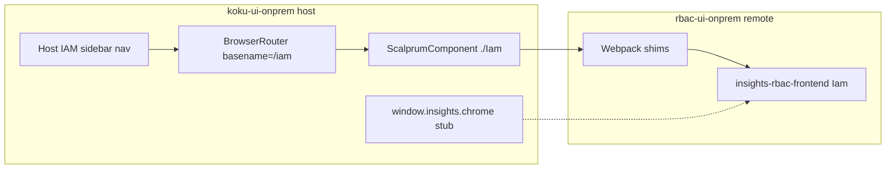

# RBAC UI maintainer call — integration nuances and upstream asks

**Context:** [FLPATH-4164](wiki/entities/flpath-4164-rbac-mfe-poc.md) POC federates pinned **insights-rbac-ui** (`b4ca3746`) into **koku-ui-onprem** via Scalprum + OpenShift `DynamicRemotePlugin` (`insightsRbac` scope, `/rbac/` assets, host routes `/iam/*`). **Constraint:** no upstream edits in the POC — workarounds live in [`apps/rbac-ui-onprem`](submodules/koku-ui/apps/rbac-ui-onprem/) and [`libs/onprem-cloud-deps`](submodules/koku-ui/libs/onprem-cloud-deps/).

**What worked without upstream changes:** Relative API paths (`/api/rbac/v1`, `/api/rbac/v2`) align with on-prem Envoy; `./Iam` is self-contained (providers inside); upstream does **not** ship its own `BrowserRouter` (expects host router — correct for MFE).

---

## 1. Integration blockers (required shims)

These are **not cosmetic** — without them the IAM tab **freezes** or **loops** (`Maximum update depth exceeded`) on cluster.

### 1.1 Router basename vs `useAppLink` (shim: [`useAppLink.ts`](submodules/koku-ui/apps/rbac-ui-onprem/src/shims/insights-rbac/useAppLink.ts))

| | SaaS (assumed) | On-prem host |
|--|----------------|--------------|
| Router | Chrome / platform router | `BrowserRouter` with **`basename="/iam"`** when URL is under `/iam` ([`onpremRemotes.ts`](submodules/koku-ui/apps/koku-ui-onprem/src/onpremRemotes.ts)) |
| `mergeToBasename` | Prepends `/iam` to relative paths | Paths like `/iam/my-user-access` must be **basename-relative** (`/my-user-access`) |

Upstream [`useAppLink`](submodules/koku-ui/node_modules/insights-rbac-frontend/src/shared/hooks/useAppLink.ts) always **adds** `/iam` unless the path already starts with it — it does **not** strip the prefix for a host that already applied basename. Used throughout [`v1/Routing.tsx`](submodules/koku-ui/node_modules/insights-rbac-frontend/src/v1/Routing.tsx) for `<Navigate>`.

**Upstream ask:** Support an explicit **embedding mode**, e.g.:

- `IamProps.routerMode?: 'platform' | 'hostBasename'` (default `platform`), or
- `IamProps.basename?: string` + `useAppLink` becomes identity / strip-only when host owns basename, or
- Document + export `mergeToBasenameForHost()` for hosts using `basename="/iam"`.

**Acceptance:** Host can mount `./Iam` under `basename="/iam"` with **no** webpack replacement of `useAppLink`.

---

### 1.2 `SkeletonTable` + module federation (shims: [`LoaderPlaceholders.tsx`](submodules/koku-ui/apps/rbac-ui-onprem/src/shims/insights-rbac/LoaderPlaceholders.tsx), PF [`SkeletonTable*`](submodules/koku-ui/apps/rbac-ui-onprem/src/shims/patternfly/), [`component-groups.ts`](submodules/koku-ui/apps/rbac-ui-onprem/src/shims/patternfly/component-groups.ts))

**Symptom:** IAM shell hangs on load; React **maximum update depth** in PatternFly table internals (`ThBase`).

**Root cause chain:**

1. [`AppPlaceholder`](submodules/koku-ui/node_modules/insights-rbac-frontend/src/shared/components/ui-states/LoaderPlaceholders.tsx) renders real `<SkeletonTable />` while `useUserData` loads ([`IamV1.tsx`](submodules/koku-ui/node_modules/insights-rbac-frontend/src/v1/IamV1.tsx)).
2. [`RolesTable`](submodules/koku-ui/node_modules/insights-rbac-frontend/src/v1/features/myUserAccess/RolesTable.tsx) imports **`{ SkeletonTableBody }` from package barrel** `@patternfly/react-component-groups` — not subpaths.
3. With MF **shared** `@patternfly/react-*`, a shared PF chunk (wiki: **6658**) + `SkeletonTable` triggers the loop in the host shell (reproduced on cluster, not only local).

**Mitigations we applied:**

- Replace loader placeholders with host-safe spinners/boxes ([`placeholders.tsx`](submodules/koku-ui/apps/rbac-ui-onprem/src/shims/placeholders.tsx)).
- `NormalModuleReplacementPlugin` + aliases for PF subpaths; **package-root** shim re-exports non-skeleton symbols from real PF dynamic paths.
- **Omit** `@patternfly/react-component-groups` from `sharedModules` in [`webpack.config.ts`](submodules/koku-ui/apps/rbac-ui-onprem/webpack.config.ts).

**Upstream asks:**

1. **Loader placeholders:** Use lightweight PF `Skeleton` / `Spinner` in `AppPlaceholder` for federated builds, or gate `SkeletonTable` behind `process.env` / build flag (`FEDERATED_PLACEHOLDER=minimal`).
2. **Import style:** Change barrel imports to **subpath** imports everywhere (e.g. `RolesTable` → `@patternfly/react-component-groups/dist/esm/SkeletonTableBody`) — documented in PF MF guidance.
3. **MF docs:** Add a “Consuming `./Iam` outside Hybrid Cloud Console” section: recommended `shared` list, **do not share** `react-component-groups` (or pin versions), known `SkeletonTable` issue.

**Acceptance:** `./Iam` loads in a Scalprum host with shared `react` / `@patternfly/react-core` without consumer webpack replacements.

---

### 1.3 `useChrome` referential stability (shim: [`onprem-cloud-deps/useChrome.ts`](submodules/koku-ui/libs/onprem-cloud-deps/src/frontend-components/useChrome.ts))

Upstream hooks (`usePlatformAuth`, `usePlatformEnvironment`, `useIdentity`, `RBACHook`) call `useChrome()` and use the return value in `useMemo` / `useEffect` deps ([`usePlatformAuth.ts`](submodules/koku-ui/node_modules/insights-rbac-frontend/src/shared/hooks/usePlatformAuth.ts), [`usePlatformEnvironment.ts`](submodules/koku-ui/node_modules/insights-rbac-frontend/src/shared/hooks/usePlatformEnvironment.ts)).

If `useChrome()` returns a **new object every render**, IAM re-renders infinitely.

**Upstream ask (RBAC + platform):**

- Document: **hosts must provide stable `useChrome()` identity** when embedding.
- Prefer selecting **stable primitives** in deps (`getToken`, `getUser`) rather than whole `chrome` object where possible.
- Optional: `PlatformProvider` context injected once at `./Iam` boundary so federated hosts do not rely on webpack aliasing `@redhat-cloud-services/frontend-components/useChrome`.

**Acceptance:** `./Iam` renders with a minimal host `window.insights.chrome` stub without aliasing `useChrome`.

---

### 1.4 Feature flags (`useFlag`) — shim: [`onprem-cloud-deps/unleash`](submodules/koku-ui/libs/onprem-cloud-deps/src/unleash/proxy-client-react.ts)

Routing and UX branch heavily on Unleash ([`v1/Routing.tsx`](submodules/koku-ui/node_modules/insights-rbac-frontend/src/v1/Routing.tsx), [`Iam.tsx`](submodules/koku-ui/node_modules/insights-rbac-frontend/src/Iam.tsx) `platform.rbac.workspaces` for V1 vs V2).

On-prem has no Unleash proxy; POC uses **env allowlist** `ONPREM_UNLEASH_FLAGS` (comma-separated), default **off**.

**Upstream asks:**

1. Document **minimum flag set** for on-prem User Access (V1) vs Access Management (V2).
2. Support **`FlagProvider` override** or build-time `define` for standalone/on-prem (e.g. `IAM_BUILD_TARGET=onprem`).
3. Export a single **`getOnPremDefaultFlags()`** or README table so hosts do not guess.

**Acceptance:** Host can enable V1-only surface without Unleash infrastructure.

---

### 1.5 RBAC permissions hook — shim: [`RBACHook.ts`](submodules/koku-ui/libs/onprem-cloud-deps/src/frontend-components-utilities/RBACHook.ts)

[`useAccessPermissions`](submodules/koku-ui/node_modules/insights-rbac-frontend/src/v1/hooks/useAccessPermissions.ts) imports `@redhat-cloud-services/frontend-components-utilities/RBACHook`, pulling platform RBAC client types into the federated bundle.

**Upstream ask:** Use in-app permission checks (Kessel / existing hooks) behind an interface, or accept `permissions` from `IamProps` / context for embedded mode.

---

## 2. Host-side nuances (not fixed in insights-rbac-ui, but explain the “not as-is” story)

| Nuance | Why | Maintainer-relevant? |
|--------|-----|----------------------|
| **Duplicate IAM nav** | Host owns sidebar; upstream `fec.config.js` has `plugins: []` (no ExtensionsPlugin) — [FLPATH-4180](wiki/entities/flpath-4180-fec-rbac-mfe.md) | Optional: export nav manifest / route metadata for hosts |
| **Cross-app navigation** | Leaving `/iam` for Cost routes uses `window.location.assign` + `remoteKey` remount — [AppLayout.tsx](submodules/koku-ui/apps/koku-ui-onprem/src/components/App/AppLayout.tsx) | Document host pattern: remount federated remote when switching app sections |
| **No nested Router** | [`onprem-entry.tsx`](submodules/koku-ui/apps/rbac-ui-onprem/src/onprem-entry.tsx) must not wrap `Iam` in second router | Already implied by MF docs; make explicit in `./Iam` contract |
| **Global CSS** | Host loads `patternfly-addons.css` for MUA responsive utilities (wiki log 2026-05-22) | Document required CSS imports for embed hosts |
| **Static Console assets** | Hardcoded `/apps/frontend-assets/technology-icons/iam.svg` in [`Overview.tsx`](submodules/koku-ui/node_modules/insights-rbac-frontend/src/shared/components/overview/Overview.tsx) | See §3.2 |
| **Chrome-dependent UX** | Breadcrumbs / document title via platform tracking — out of POC scope ([VISUAL_SIGNOFF](wiki/entities/flpath-4164/visual-compare/VISUAL_SIGNOFF.md)) | Optional callbacks on `IamProps` for title/breadcrumb |

---

## 3. Additional upstream improvements (no shim today, but friction)

### 3.1 Module Federation guide gap

[`ModuleFederation.mdx`](submodules/koku-ui/node_modules/insights-rbac-frontend/src/docs/ModuleFederation.mdx) states modules are “self-contained” but troubleshooting says **“Console platform environment”** — incomplete for Cost on-prem / third-party Scalprum hosts.

**Proposed doc additions:**

- Host checklist: single `BrowserRouter`, `basename` contract, `window.insights.chrome` shape, Unleash/flags, `/api/rbac` same-origin, static asset base, PF shared-module matrix, `./Iam` vs partial modules (`WorkspaceSelector`).
- Scalprum example (not only FEC `AsyncComponent` + `appName="rbac"`).

### 3.2 Configurable static asset base

Replace hardcoded `/apps/frontend-assets/...` with `import.meta` / env / `IamProps.assetBaseUrl` and bundle icons for federated builds (or document host must mirror Console paths — we vendored `iam.svg` on host).

### 3.3 Federated entry contract

Clarify in [`federated-modules/Iam.tsx`](submodules/koku-ui/node_modules/insights-rbac-frontend/src/federated-modules/Iam.tsx) JSDoc:

- **Requires** parent `Router` (v6).
- **Does not** include Router (unlike Storybook `AppEntryWithRouter`).
- Lists platform dependencies: chrome, unleash, notifications (already inside bundle).

### 3.4 Build / packaging for third-party consumers

Today: npm package `insights-rbac-frontend` + separate webpack wrapper ([`rbac-ui-onprem`](submodules/koku-ui/apps/rbac-ui-onprem/)).

**Ask:** Official **on-prem / embedded** build profile (webpack config or published `dist` remote) with placeholders and MF metadata — reduces forked wrappers per host product.

---

## 4. Suggested call agenda (30–45 min)

1. **Goal alignment** — Cost on-prem embeds full IAM V1 (later V2) under `/iam`, same-origin RBAC API; maintainer sync [FLPATH-4152].
2. **Showstopper recap** (10 min) — basename/`useAppLink`, SkeletonTable/MF, stable chrome (demo: without shims → freeze).
3. **Platform vs product ownership** (10 min) — `useChrome` stability (frontend-components), Unleash vs build flags, RBACHook.
4. **Prioritized asks** (15 min) — agree P0/P1:
   - **P0:** `useAppLink` host-basename mode; loader placeholder without `SkeletonTable`; barrel → subpath PF imports; MF embedding doc.
   - **P1:** `IamProps` platform injection; on-prem flag profile; asset base URL.
   - **P2:** Nav manifest export; official embedded build artifact.
5. **Path forward** — upstream PRs vs continued wrapper pin; version bump process ([`rbac-ui.version.json`](submodules/koku-ui/apps/rbac-ui-onprem/rbac-ui.version.json)).

---

## 5. Evidence to bring

| Artifact | Location |
|----------|----------|
| Shim inventory | [wiki/topics/rbac-ui-onprem-shims.md](wiki/topics/rbac-ui-onprem-shims.md) |
| POC status + nav diagnosis | [wiki/entities/flpath-4164-rbac-mfe-poc.md](wiki/entities/flpath-4164-rbac-mfe-poc.md) |
| FEC vs Scalprum | [wiki/entities/flpath-4180-fec-rbac-mfe.md](wiki/entities/flpath-4180-fec-rbac-mfe.md) |
| Visual parity / host-only fixes | [wiki/entities/flpath-4164/visual-compare/VISUAL_SIGNOFF.md](wiki/entities/flpath-4164/visual-compare/VISUAL_SIGNOFF.md) |
| Live E2E | `koku-ui-onprem` Cypress `cypress/e2e/live/` (21 tests) |

**Pin for reproducibility:** `insights-rbac-ui@b4ca374603344a60ea3260433a4c913f1ff93ae3`

---

## 6. Optional follow-up (workspace, post-call)

- Add a one-page **“Maintainer handoff”** section to [flpath-4164-rbac-mfe-poc.md](wiki/entities/flpath-4164-rbac-mfe-poc.md) linking this brief (after call outcomes).
- File upstream issues/PRs with shim diffs as **proposed patches** for each P0 item.
- Draft Jira comment for FLPATH-4152 (user approval per [jira-slack-approval](.cursor/rules/jira-slack-approval.mdc)).
