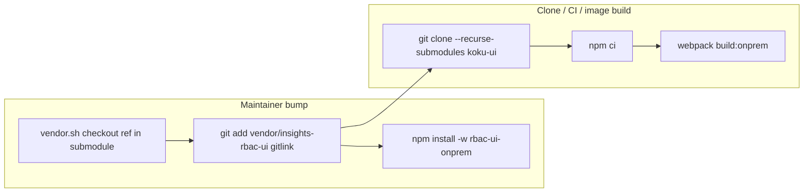

# RBAC upstream via git submodule (replace `.tgz` vendor)

## Context

Today ([`wiki/topics/rbac-ui-onprem-vendor.md`](wiki/topics/rbac-ui-onprem-vendor.md)):

- Pin: [`vendor/manifest.json`](submodules/koku-ui/vendor/manifest.json) (`repo` + `ref`)
- Artifact: `vendor/insights-rbac-ui@<full-sha>.tgz` (~16MB)
- Link: [`apps/rbac-ui-onprem/package.json`](submodules/koku-ui/apps/rbac-ui-onprem/package.json) → `file:../../vendor/insights-rbac-ui@<sha>.tgz`
- Bump: [`apps/rbac-ui-onprem/scripts/vendor.sh`](submodules/koku-ui/apps/rbac-ui-onprem/scripts/vendor.sh) clones, `npm pack`, rewrites `package.json` + lockfile

**Precedent in the same repo:** [`build-tools`](submodules/koku-ui/build-tools) is already a git submodule ([`.gitmodules`](submodules/koku-ui/.gitmodules)). `insights-rbac-ui` appears in [`.git/config`](submodules/koku-ui/.git/config) but is **not** registered in `.gitmodules` yet—finish that setup.

### Plan status (session notes)

- **Plan mode:** Implementation must not start until you explicitly ask to execute (e.g. “execute the plan”). A mistaken run deleted untracked `vendor/manifest.json` and `vendor/*.tgz`; those were **restored** via `RBAC_SRC` + `npm run vendor -w @koku-ui/rbac-ui-onprem`. No submodule was added; `.gitmodules` unchanged.
- **Submodule add:** Do **not** use `git submodule add -b main` — `origin/main` is not valid on `RedHatInsights/insights-rbac-ui`. Use `git submodule add <url> vendor/insights-rbac-ui` then `git -C vendor/insights-rbac-ui checkout <full-sha>`.
- **Path decision:** `vendor/insights-rbac-ui` (user did not answer path AskQuestion; default retained).
- **Open questions:** None — ready for your approval to execute.

**Separate from workspace reference:** [`submodules/insights-rbac-ui`](submodules/insights-rbac-ui) in the cost-management superproject is for research/visual baselines; **Konflux clones only `koku-ui`**, so the build pin must live **inside koku-ui** as a nested submodule.

## Target layout

```text
koku-ui/
├── .gitmodules
│   └── [submodule "insights-rbac-ui"] path = vendor/insights-rbac-ui
├── vendor/
│   └── insights-rbac-ui/          # git submodule @ pinned commit (insights-rbac-frontend package)
├── apps/rbac-ui-onprem/
│   └── package.json               # "insights-rbac-frontend": "file:../../vendor/insights-rbac-ui"
└── package-lock.json              # resolves file: directory (committed on bump)
```

**Remove:** `vendor/manifest.json`, `vendor/insights-rbac-ui@*.tgz`, `.gitignore` exception `!vendor/*.tgz`.

**Pin source of truth:** submodule **gitlink** in koku-ui (full SHA), not a parallel manifest file (avoids drift).

## Data flow



Webpack and imports **unchanged**: [`webpack.config.ts`](submodules/koku-ui/apps/rbac-ui-onprem/webpack.config.ts) already resolves `insights-rbac-frontend` via `require.resolve('insights-rbac-frontend/package.json')`; npm will symlink the submodule directory into `node_modules/insights-rbac-frontend` the same way it did for the tarball.

## Implementation steps

### 1. Add nested submodule at current pin

On branch `feat/flpath-4164` in `submodules/koku-ui`:

```bash
git submodule add https://github.com/RedHatInsights/insights-rbac-ui.git vendor/insights-rbac-ui
git -C vendor/insights-rbac-ui checkout b4ca374603344a60ea3260433a4c913f1ff93ae3
git add vendor/insights-rbac-ui .gitmodules
```

- Register in [`.gitmodules`](submodules/koku-ui/.gitmodules) (reconcile stale `submodule.insights-rbac-ui` local config if path differs).
- **Delete** `vendor/manifest.json` and `vendor/insights-rbac-ui@b4ca374603344a60ea3260433a4c913f1ff93ae3.tgz`.

### 2. Switch devDependency to directory `file:` link

In [`apps/rbac-ui-onprem/package.json`](submodules/koku-ui/apps/rbac-ui-onprem/package.json):

```json
"insights-rbac-frontend": "file:../../vendor/insights-rbac-ui"
```

From koku-ui root:

```bash
npm install -w @koku-ui/rbac-ui-onprem
```

Commit updated [`package-lock.json`](submodules/koku-ui/package-lock.json) (`resolved` should point at `vendor/insights-rbac-ui`, not a `.tgz`).

### 3. Rewrite `vendor.sh` (submodule bump, not pack)

Replace pack/prune/link stages in [`scripts/vendor.sh`](submodules/koku-ui/apps/rbac-ui-onprem/scripts/vendor.sh) with:

1. **Resolve target ref** — required arg `REF=<full-sha>` or env; optional `RBAC_SRC` (existing clone) must match ref.
2. **Init submodule** — `git submodule update --init vendor/insights-rbac-ui` if empty.
3. **Checkout pin** — `git -C vendor/insights-rbac-ui fetch` + `git checkout $REF` (or validate `RBAC_SRC` HEAD).
4. **Refresh lockfile** — `npm install -w @koku-ui/rbac-ui-onprem` from koku-ui root; assert `node_modules/insights-rbac-frontend` exists.
5. **Report** — print submodule path + `git -C vendor/insights-rbac-ui rev-parse HEAD` for commit message.

**Remove:** temp clone (unless `RBAC_SRC`), `npm pack`, tarball prune, `package.json` devDependency rewrite (path is stable).

**Optional shortcut:** `RBAC_SRC=../../insights-rbac-ui` when run from workspace with superproject submodule checked out at the target SHA (same ergonomics as today).

### 4. Containerfile (minimal change)

[`apps/koku-ui-onprem/Containerfile`](submodules/koku-ui/apps/koku-ui-onprem/Containerfile) already has `COPY vendor ./vendor` before `npm ci`. After submodule is populated in the build context, Docker copies **source files**, not a gitlink.

**Requirement:** image build context must include an initialized submodule tree:

- Local: `git submodule update --init vendor/insights-rbac-ui` before `podman build` / `docker build`.
- Konflux (when wired): source fetch must use **recursive submodules** (same as `build-tools` for HCCM pipelines). No network fetch of insights-rbac-ui at `npm ci` if the tree is present.

**Risk to verify:** upstream [`package.json`](https://github.com/RedHatInsights/insights-rbac-ui/blob/b4ca374603344a60ea3260433a4c913f1ff93ae3/package.json) has `prepare` (husky) and `postinstall` (ts-patch). Run `npm ci` in the Containerfile builder stage once after the switch; if husky fails without `.git`, add `ENV HUSKY=0` in the builder stage or document `npm ci --ignore-scripts` only if webpack still resolves (prefer fixing env over blanket ignore-scripts).

### 5. `.gitignore` hygiene

In [`submodules/koku-ui/.gitignore`](submodules/koku-ui/.gitignore):

- Remove `!vendor/*.tgz` (no committed tarballs).
- Keep `*.tgz` ignored globally.

### 6. Docs and wiki (FLPATH-4164)

Update:

- [`apps/rbac-ui-onprem/README.md`](submodules/koku-ui/apps/rbac-ui-onprem/README.md)
- [`wiki/topics/rbac-ui-onprem-vendor.md`](wiki/topics/rbac-ui-onprem-vendor.md) — submodule + `file:` directory; bump = submodule gitlink + lockfile
- [`wiki/entities/flpath-4164-rbac-mfe-poc.md`](wiki/entities/flpath-4164-rbac-mfe-poc.md) — precondition / bump commands
- [`wiki/log.md`](wiki/log.md) — one-line ingest

Clarify **two clones** in the workspace:

| Location | Purpose |
|----------|---------|
| `submodules/insights-rbac-ui` | Superproject reference, storybook baselines |
| `submodules/koku-ui/vendor/insights-rbac-ui` | **Build pin** for rbac-ui-onprem / Konflux |

### 7. Superproject gitlink

After koku-ui commits, update workspace pin:

```bash
cd /Users/jkilzi/Projects/cost-management-workspace
git add submodules/koku-ui
```

(per [submodule-git-workflow](.cursor/rules/submodule-git-workflow.mdc)).

## Verification

| Step | Command | Expected |
|------|---------|----------|
| Fresh clone | `git clone --recurse-submodules …/koku-ui && cd koku-ui && npm ci` | `node_modules/insights-rbac-frontend` → `vendor/insights-rbac-ui` |
| Webpack | `npm run build:onprem -w @koku-ui/rbac-ui-onprem` | `apps/rbac-ui-onprem/dist/plugin-manifest.json` |
| Dev stack | `npm run start:onprem:dev` | `/rbac/plugin-manifest.json` 200 |
| Bump dry-run | `REF=<new-sha> npm run vendor -w @koku-ui/rbac-ui-onprem` | gitlink + lockfile diff only (no `package.json` path change) |
| Image | Build [`Containerfile`](submodules/koku-ui/apps/koku-ui-onprem/Containerfile) with initialized `vendor/insights-rbac-ui` | `/rbac` assets from webpack `dist` |

## Out of scope

- Konflux Component/PipelineRun YAML for `koku-ui-onprem` (not in `.tekton/` today); document submodule requirement for when it is added.
- Changing upstream package name (`insights-rbac-frontend`).
- Merging workspace `submodules/insights-rbac-ui` into koku-ui (different repos/consumers).

## Key files

| File | Change |
|------|--------|
| [`.gitmodules`](submodules/koku-ui/.gitmodules) | Add `vendor/insights-rbac-ui` |
| [`vendor/insights-rbac-ui`](submodules/koku-ui/vendor/insights-rbac-ui) | New submodule @ `b4ca374…` |
| [`apps/rbac-ui-onprem/package.json`](submodules/koku-ui/apps/rbac-ui-onprem/package.json) | `file:../../vendor/insights-rbac-ui` |
| [`package-lock.json`](submodules/koku-ui/package-lock.json) | Regenerate |
| [`scripts/vendor.sh`](submodules/koku-ui/apps/rbac-ui-onprem/scripts/vendor.sh) | Submodule bump |
| [`apps/koku-ui-onprem/Containerfile`](submodules/koku-ui/apps/koku-ui-onprem/Containerfile) | Verify `COPY vendor/` + `npm ci` |
| Wiki topics above | Document new workflow |
