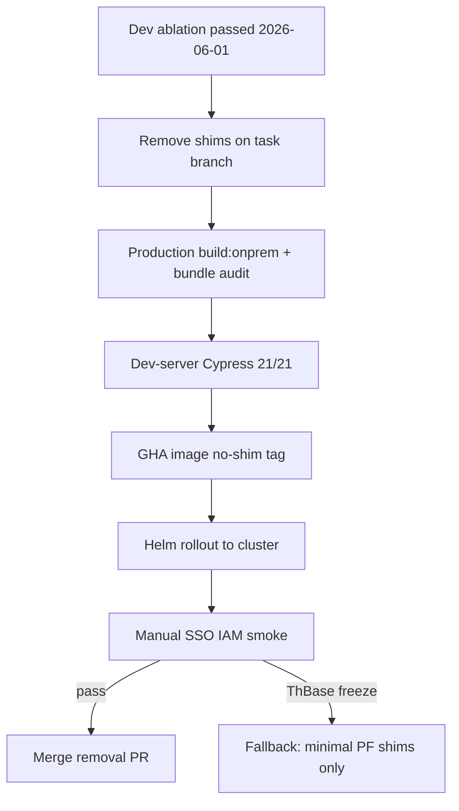

# Remove rbac-ui-onprem shims (production + cluster gate)

## Context

The [2026-06-01 shim analysis](wiki/topics/rbac-ui-onprem-shims.md#necessity-analysis-2026-06-01) found **all app-local shims optional on webpack-dev**: live Cypress **21/21** on `start:onprem:dev` even with every replacement disabled (including sharing `@patternfly/react-component-groups`).

**Gap:** No **no-shim production image** was built or rolled out. The original rc16 tab freeze was on **cluster nginx + production chunks**, not dev watch. Cluster still runs **`quay.io/jkilzi/koku-ui-onprem:flpath-4164-rc25`** (with shims).

This plan closes that gate, then removes shims if cluster smoke passes.

**Out of scope:** [`libs/onprem-cloud-deps`](submodules/koku-ui/libs/onprem-cloud-deps/) — keep `useChrome`, Unleash, AsyncComponent aliases in [`webpack.config.ts`](submodules/koku-ui/apps/rbac-ui-onprem/webpack.config.ts).



## Phase 1 — Code removal (koku-ui task branch)

**Branch:** `submodules/koku-ui` → e.g. `chore/remove-rbac-ui-onprem-shims` off default (per [submodule-git-workflow](.cursor/rules/submodule-git-workflow.mdc)).

### Delete

- Entire tree [`apps/rbac-ui-onprem/src/shims/`](submodules/koku-ui/apps/rbac-ui-onprem/src/shims/) (insights-rbac, patternfly, `placeholders.tsx`)

### Edit [`webpack.config.ts`](submodules/koku-ui/apps/rbac-ui-onprem/webpack.config.ts)

Remove:

- `shimsDir`, `rbacUiOnpremShims` object
- `insightsRbacModuleReplacements` array and its `NormalModuleReplacementPlugin` spread
- `NormalModuleReplacementPlugin` for `@patternfly/react-component-groups`
- Aliases: `@rbac-ui-onprem/shims`, `useAppLink` path aliases, four `SkeletonTable*` subpath aliases

**Keep** (platform coupling, not app shims):

- `onprem-cloud-deps` aliases (`useChrome`, `AsyncComponent`, `RBACHook`, Unleash)
- Current `sharedModules` list — **retain omission of `@patternfly/react-component-groups`** until cluster smoke proves sharing is safe (analysis was uncertain here)

### Edit [`tsconfig.json`](submodules/koku-ui/apps/rbac-ui-onprem/tsconfig.json)

Remove path mapping `@rbac-ui-onprem/shims/*`.

### Edit [`README.md`](submodules/koku-ui/apps/rbac-ui-onprem/README.md)

Drop references to `src/shims/`; note shims removed after 2026-06-01 analysis + cluster gate.

## Phase 2 — Local production verification

From `submodules/koku-ui`:

```bash
npm run build:onprem -w @koku-ui/rbac-ui-onprem
test -f apps/rbac-ui-onprem/dist/plugin-manifest.json
```

**Bundle audit** (compare mentally to pre-removal baseline from analysis):

```bash
rg -l "OnpremIamSpinner" apps/rbac-ui-onprem/dist/*.js || echo "no shim markers (expected)"
rg -l "ThBase|SkeletonTable" apps/rbac-ui-onprem/dist/*.js | head -10
```

Record: real PF `SkeletonTable` in dist is **expected** after removal; watch for chunk **6658**-style shared splits only if you later add `component-groups` to `sharedModules`.

Full stack build (optional but recommended before GHA):

```bash
npm run build:onprem
```

## Phase 3 — Dev-server regression (cluster-backed)

```bash
npm run start:onprem:dev
# second terminal:
npm run test:cypress:live -w @koku-ui/koku-ui-onprem
```

**Gate:** **21/21** pass, no `Maximum update depth` (`assertNoDepthConsoleErrors`).

This re-confirms removal on the same stack used in the analysis.

## Phase 4 — Production image build + cluster rollout

Follow [koku-ui-onprem-cluster-image skill](.cursor/skills/koku-ui-onprem-cluster-image/SKILL.md):

1. Push workspace **koku-ui gitlink** on task branch (or merge to main first, per your workflow).
2. **Build:** `bash .cursor/skills/koku-ui-onprem-cluster-image/scripts/trigger-build.sh flpath-4164-no-shim-rc1 [ref]`
3. **Rollout:** set `ui.app.image.tag: flpath-4164-no-shim-rc1` in `ui-image-values.local.yaml` → `rollout-ui-image.sh` → `verify-ui-pod.sh`
4. In-pod check: `/rbac/plugin-manifest.json` **200**

## Phase 5 — Cluster SSO manual smoke (required gate)

Behind oauth2-proxy / Keycloak (cannot automate in Cypress today per [FLPATH-4164 entity](wiki/entities/flpath-4164-rbac-mfe-poc.md)):

| Step | Action | Pass criteria |
|------|--------|---------------|
| 1 | Cost Overview → IAM **My User Access** | Page loads; no tab freeze |
| 2 | IAM sidebar chain: Overview → MUA → Users → Roles → Groups | Path stays `/iam/...`; no `/iam/iam/...` |
| 3 | Sidebar toggle twice on IAM | Responsive; no hang |
| 4 | IAM → Cost Settings/Overview | Exit works |
| 5 | DevTools Console on MUA | No `Maximum update depth exceeded` |
| 6 | MUA roles table visible | Data loads (RBAC API via Envoy) |

**Fail criteria (historical):** tab freeze, infinite spinner on MUA, depth errors — same symptoms as [nav diagnosis](wiki/entities/flpath-4164-rbac-mfe-poc.md#nav-diagnosis-2026-05-19-resolved).

## Phase 6 — Decision and merge

| Outcome | Action |
|---------|--------|
| **Pass** | Open koku-ui PR removing shims; update wiki; bump superproject gitlink |
| **Fail on MUA / SkeletonTable only** | **Fallback A:** restore only PF subpath aliases + barrel `component-groups.ts` (smallest set analysis identified); rebuild image `no-shim-pf-rc1`, re-smoke |
| **Fail on nav / pathname** | **Fallback B:** restore `useAppLink` shim only; re-smoke |
| **Fail with shared chunk 6658** | Keep barrel shim + omit `component-groups` from `sharedModules` (current policy) |

Do **not** merge full removal until Phase 5 passes.

## Wiki updates (after decision)

- [wiki/topics/rbac-ui-onprem-shims.md](wiki/topics/rbac-ui-onprem-shims.md) — mark removed or document minimal retained set + cluster evidence
- [wiki/entities/flpath-4164-rbac-mfe-poc.md](wiki/entities/flpath-4164-rbac-mfe-poc.md) — image tag, verification bullets
- [wiki/log.md](wiki/log.md) — ingest line with tag + pass/fail

## Risk summary

| Risk | Mitigation |
|------|------------|
| Production-only ThBase loop | Phase 4–5 on nginx image, not dev-only |
| Double `/iam` pathname | Phase 5 nav chain + Cypress pathname specs on dev |
| Konflux/regression in CI | `build:onprem` in koku-ui PR checks |
| Over-removal | Staged fallbacks (PF-only, then useAppLink) before full revert |

## Prerequisites

- `oc` logged into cluster with cost-onprem
- Quay push secrets for GHA build
- Prior analysis recorded: [wiki/topics/rbac-ui-onprem-shims.md](wiki/topics/rbac-ui-onprem-shims.md)
