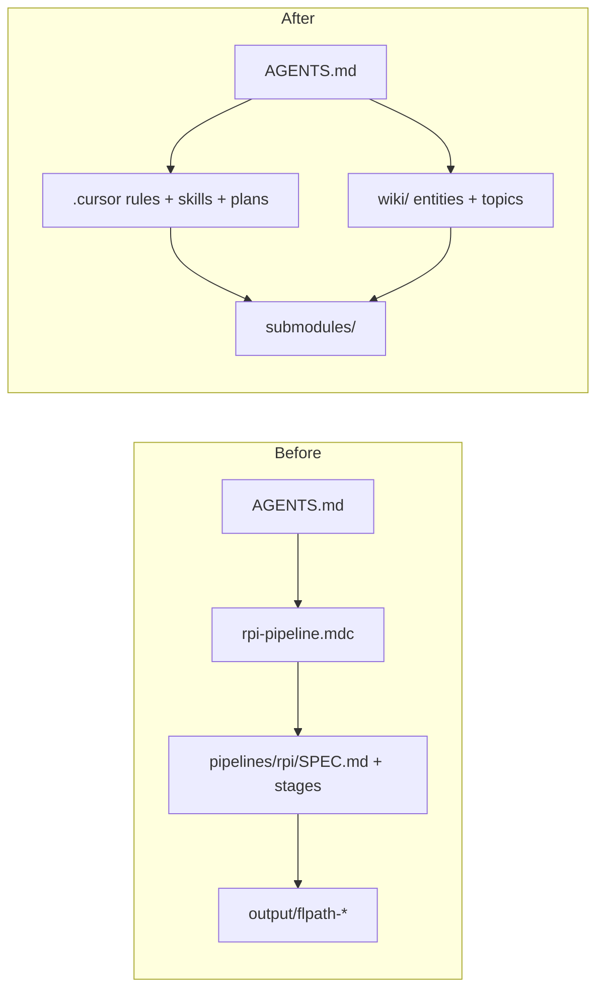

# Remove RPI pipeline experiment (`feat/no-pipelines`)

## Goal

Remove the **RPI v1** contract from this meta-repo (`pipelines/rpi/`, `@rpi-status`, [`.cursor/rules/rpi-pipeline.mdc`](.cursor/rules/rpi-pipeline.mdc)) and work from the **Cursor harness** only: rules, existing skills, Plan mode under [`.cursor/plans/`](.cursor/plans/), submodule workflow, and the Karpathy wiki.

**Out of scope (separate thread):** [`.cursor/skills/koku-ui-onprem-cluster-image/`](.cursor/skills/koku-ui-onprem-cluster-image/) — cluster UI image build (`Dockerfile.pack-amd64`, `ui-image-values.yaml`, Containerfile/npm). Those files live under `pipelines/.../flpath-4164/` today and will be removed with the tree; recoverable from **git history** until the skill thread lands.



## Phase 0 — Branch (first executable step)

From current `main`:

```bash
git checkout -b feat/no-pipelines
```

## Phase 1 — Migrate essentials into wiki (before delete)

**Principle:** Entity/topic pages become the **single source of truth** for agents; Jira-facing prose stays self-contained per [wiki/workspace/jira-handoff-without-public-repo.md](wiki/workspace/jira-handoff-without-public-repo.md).

### 1.1 FLPATH-4164 ([wiki/entities/flpath-4164-rbac-mfe-poc.md](wiki/entities/flpath-4164-rbac-mfe-poc.md))

| Source (pipeline) | Wiki destination |
|-------------------|------------------|
| [`20-plan/.../PLAN.md`](pipelines/rpi/v1/stages/20-plan/output/flpath-4164/PLAN.md) | **## Plan (phases)** — phase table 0–9, UX vision, open items |
| [`40-verify/.../ACCEPTANCE_CRITERIA.md`](pipelines/rpi/v1/stages/40-verify/output/flpath-4164/ACCEPTANCE_CRITERIA.md) | **## Acceptance criteria** (condensed; keep Cypress commands) |
| [`40-verify/.../VERIFICATION.md`](pipelines/rpi/v1/stages/40-verify/output/flpath-4164/VERIFICATION.md) | Fold into **Implementation status** |
| [`visual-compare/`](pipelines/rpi/v1/stages/40-verify/output/flpath-4164/visual-compare/) | `wiki/entities/flpath-4164/visual-compare/` (PNGs + `VISUAL_SIGNOFF.md`) |
| [`20-plan/.../NAV-DIAGNOSIS.md`](pipelines/rpi/v1/stages/20-plan/output/flpath-4164/NAV-DIAGNOSIS.md) | Short **## Nav diagnosis** summary |
| [`10-research/.../RESEARCH.md`](pipelines/rpi/v1/stages/10-research/output/flpath-4164/RESEARCH.md) | Facts not already on entity page only |
| [`30-implement/.../IMPLEMENTATION_LOG.md`](pipelines/rpi/v1/stages/30-implement/output/flpath-4164/IMPLEMENTATION_LOG.md) | **## Cluster deploy (interim)** — current image `quay.io/<your-org>/koku-ui-onprem:flpath-4164-rc21`, cluster name, one-line deploy (`oc set image` / helm). Note: full pack recipe deferred to future skill thread; prior detail in git at deleted pipeline paths |

Remove “Pipeline SoT” header and all `pipelines/rpi/...` links.

### 1.2 FLPATH-4180 ([wiki/entities/flpath-4180-fec-rbac-mfe.md](wiki/entities/flpath-4180-fec-rbac-mfe.md))

- Inline research/plan conclusions from pipeline `10-research` / `20-plan` outputs.
- **## Delivery log** from `IMPLEMENTATION_LOG.md` + `VERIFICATION.md`.

### 1.3 FLPATH-3424

- Optional stub `wiki/entities/flpath-3424-onprem-iam-epic.md` or **## Parent epic** on 4164 page if `flpath-3424/RESEARCH.md` has durable facts.

### 1.4 Verification topic

- Rename [`wiki/topics/rpi-verify-ui-acceptance.md`](wiki/topics/rpi-verify-ui-acceptance.md) → `wiki/topics/ui-verification-and-e2e.md`.
- Cursor-era flow: plan in chat/`.cursor/plans/`, AC on entity page, Cypress per [onprem-playwright-e2e.md](wiki/topics/onprem-playwright-e2e.md), record outcomes on entity page.
- Update [wiki/index.md](wiki/index.md) and inbound links.

### 1.5 Cross-cutting wiki

| File | Change |
|------|--------|
| [wiki/workspace/overview.md](wiki/workspace/overview.md) | Meta-repo = wiki + constitutions + submodules + `.cursor/` (no `pipelines/`) |
| [wiki/workspace/jira-handoff-without-public-repo.md](wiki/workspace/jira-handoff-without-public-repo.md) | Remove “Close the RPI loop”; wiki entity + Jira comment |
| [wiki/topics/onprem-playwright-e2e.md](wiki/topics/onprem-playwright-e2e.md) | AC → entity page |
| [wiki/log.md](wiki/log.md) | Ingest line for migration + pipeline removal |

---

## Phase 2 — Remove RPI machinery

### Delete

- [`pipelines/`](pipelines/) (entire tree, including `Dockerfile.pack-amd64`, `ui-image-values.yaml`, and all scoped outputs)
- [`.cursor/rules/rpi-pipeline.mdc`](.cursor/rules/rpi-pipeline.mdc)
- [`scripts/rpi/`](scripts/rpi/) (e.g. `copy-flpath-4164-cluster-visual-compare.sh`)

### Rewrite [AGENTS.md](AGENTS.md)

- Drop pipeline purpose, folder map entry, RPI routing row, `@rpi-status` and `@<pipeline-id>-status` triggers.
- Keep `@wiki-lint`, submodule git, constitutions, submodules, [cost-onprem-chart-install](.cursor/skills/cost-onprem-chart-install/SKILL.md).

### Add [`.cursor/rules/workspace-workflow.mdc`](.cursor/rules/workspace-workflow.mdc)

- Scope = Jira slug; tracking = `wiki/entities/` + optional `.cursor/plans/<scope>.plan.md`.
- Implement in `submodules/` on task branches; verify per ui-verification topic; **no** `pipelines/` or `@rpi-status`.
- Link from AGENTS.md (replaces `rpi-pipeline.mdc`).

### Update [`.cursor/rules/llm-wiki.mdc`](.cursor/rules/llm-wiki.mdc)

- SoT = wiki + submodule upstream docs (not `pipelines/` scoped output).

### Leave as-is

- [`.cursor/plans/*`](.cursor/plans/) — may reference deleted paths; optional AGENTS footnote.
- [`.obsidian/workspace.json`](.obsidian/workspace.json) — optional tab cleanup.

---

## Phase 3 — Verification

1. `rg -i 'pipelines/rpi|@rpi-status|rpi-pipeline' --glob '!*.plan.md'` → zero hits in `AGENTS.md`, `.cursor/rules/`, `wiki/`, `constitutions/`.
2. Wiki entity pages: no broken links to `pipelines/`.
3. `git status` ready for user commit (no auto-commit).

---

## Replacement workflow

| Step | Where |
|------|--------|
| Research | Chat + constitutions + code → `wiki/entities/<ticket>.md` |
| Plan | `.cursor/plans/<ticket>.plan.md` (optional) |
| Implement | `submodules/<repo>/` feature branch |
| Verify | [ui-verification-and-e2e.md](wiki/topics/ui-verification-and-e2e.md) + entity page |
| Handoff | [jira-handoff-without-public-repo.md](wiki/workspace/jira-handoff-without-public-repo.md) |
| Cluster UI image | **Separate thread** (future skill) |

---

## Risk notes

- **Cluster image build** — pipeline pack Dockerfile and `ui-image-values.yaml` are deleted; interim wiki note + git history until skill thread.
- **Old `.cursor/plans/`** — may have stale `pipelines/` paths; normative docs must be clean.
