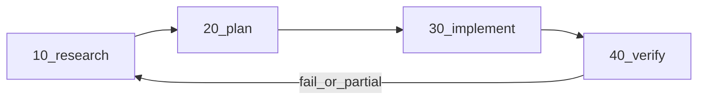

# RPI: verify failure → research intake loop

## Goal

When **`40-verify`** ends in **fail** or **partial pass**, the pipeline should **not** be treated as done. The specs will require returning to **`10-research`**: first capture verification conclusions as **research intake**, then refresh facts in **`RESEARCH.md`** (and **`QUESTIONS.md`** if needed), re-run **FAR**, then proceed **`20-plan` → `30-implement` → `40-verify`** again on the same `<scope>`.

## Normative artifact (new, optional)

Add an **optional** file under research only when entering this loop (same path pattern as other stage outputs):

- **Path:** [`pipelines/rpi/v1/stages/10-research/output/<scope>/VERIFICATION_INTAKE.md`](pipelines/rpi/v1/stages/10-research/output/<scope>/VERIFICATION_INTAKE.md) *(filename fixed in spec so `@rpi-status` can list it)*

**Purpose:** Denormalized handoff from verify → research: link to [`40-verify` `VERIFICATION.md`](pipelines/rpi/v1/stages/40-verify/SPEC.md), short list of failed checks / evidence, what was wrong in understanding vs environment, and **what new facts** research must establish. Avoid duplicating full logs—**link + summary**, human-reviewable.

*(Alternative rejected for spec clarity: only a `RESEARCH.md` section—harder to spot in status and mixes “stable map” with “incident log.”)*

## Files to update (spec-only; no code)

| File | Change |
|------|--------|
| [`pipelines/rpi/SPEC.md`](pipelines/rpi/SPEC.md) | Extend **Artifact chain** with a short **“Verification loop”** subsection: linear chain remains default; on verify fail/partial, create/update **`VERIFICATION_INTAKE.md`**, update **`RESEARCH.md`**, then downstream stages. Update **`@rpi-status`** table: **10-research** row adds optional **`VERIFICATION_INTAKE.md`**. Optionally add **Next action** example: “verify failed → complete intake + refresh research.” |
| [`pipelines/rpi/v1/stages/40-verify/SPEC.md`](pipelines/rpi/v1/stages/40-verify/SPEC.md) | In **Process** / **Exit criteria**: on **fail** or **partial pass**, require **(1)** complete **`VERIFICATION.md`** as today, **(2)** create or update **`VERIFICATION_INTAKE.md`** under **10-research** for the same scope (content contract: link to verify artifact, bullets for failures and follow-ups), **(3)** explicit **next stage: 10-research** (refresh facts, FAR) before a new **`PLAN.md`**. Clarify that **pass** does not require intake. |
| [`pipelines/rpi/v1/stages/10-research/SPEC.md`](pipelines/rpi/v1/stages/10-research/SPEC.md) | **Inputs:** Replace “Prior runs: none” with: on first pass, user goal + constitutions; **on verify loop-back**, add **`../40-verify/output/<scope>/VERIFICATION.md`** and the in-scope **`VERIFICATION_INTAKE.md`** as mandatory reads. **Process:** Add steps for **re-research pass** (when intake exists or verify failed): reconcile intake with repo, update **`RESEARCH.md`** (facts only), trim or extend **`QUESTIONS.md`**, re-satisfy **FAR**. **Outputs** table: add optional **`VERIFICATION_INTAKE.md`** row (who creates it: verify stage on exit fail/partial; research stage may extend during re-pass). |
| [`pipelines/rpi/v1/stages/20-plan/SPEC.md`](pipelines/rpi/v1/stages/20-plan/SPEC.md) | **Inputs:** If **`VERIFICATION_INTAKE.md`** exists, planners must read it with **`RESEARCH.md`** so **`PLAN.md`** addresses verified gaps. |
| [`pipelines/rpi/v1/stages/30-implement/SPEC.md`](pipelines/rpi/v1/stages/30-implement/SPEC.md) | One sentence: after a verify loop, follow the **new** **`PLAN.md`**; **`IMPLEMENTATION_LOG.md`** may reference the intake round (optional, keep minimal). |
| [`.cursor/rules/rpi-pipeline.mdc`](.cursor/rules/rpi-pipeline.mdc) | Layer map: **10-research** and **40-verify** one-line summaries mention **verify loop** + **`VERIFICATION_INTAKE.md`** so the index matches behavior. |

**Out of scope (unless you want it):** [`AGENTS.md`](AGENTS.md) trigger row for `@rpi-status` can stay unchanged (it already points at [`pipelines/rpi/SPEC.md`](pipelines/rpi/SPEC.md)). No submodule or script changes unless you later add automation.

## Flow (reference)

## Wiki (optional follow-up)

Per [`.cursor/rules/llm-wiki.mdc`](.cursor/rules/llm-wiki.mdc), after merging this behavior, a one-line **ingest** in [`wiki/log.md`](wiki/log.md) and a short note on an existing or new **`wiki/`** page about RPI (if you have one) keeps the loop discoverable outside the pipeline folder. Skip if you prefer specs-only.

## Acceptance

- A reader can answer: **What do I do when `VERIFICATION.md` is fail?** from **`40-verify`** + **`10-research`** specs alone.
- **`@rpi-status`** documents the optional intake file so loops are visible in status output.
