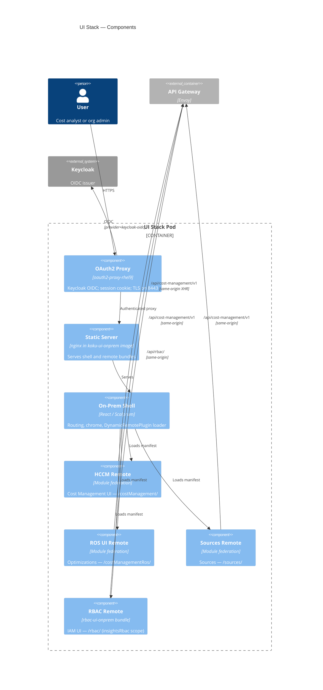

# C4 Level 3 — UI stack components

Internal structure of the **UI Stack** pod: **oauth2-proxy** sidecar plus the **koku-ui-onprem** application container (nginx serving static bundles and module-federation remotes).

## Component diagram

## Runtime layout

| Component | Process | Port (typical) |
|-----------|---------|----------------|
| **OAuth2 Proxy** | Sidecar container | 8443 (HTTPS) — exposed via Service/Route |
| **koku-ui-onprem** | App container | 8080 — nginx + static assets |

OpenShift Route targets the UI Service, which forwards to oauth2-proxy. Authenticated requests reach nginx/static content on the app port.

## On-prem shell

**Repository:** [`submodules/koku-ui/apps/koku-ui-onprem/`](../../../submodules/koku-ui/apps/koku-ui-onprem/)

- **Scalprum / module federation** — Host loads remote plugin manifests at runtime (`DynamicRemotePlugin`).
- **Chrome** — Navigation and layout via on-prem shims in [`libs/onprem-cloud-deps`](../../../submodules/koku-ui/libs/onprem-cloud-deps/) (replaces SaaS `@redhat-cloud-services` packages at build time).
- **Feature flags** — Unleash shim (`proxy-client-react`) for on-prem builds.

### Federated remotes (production manifests)

Configured in [`App.tsx`](../../../submodules/koku-ui/apps/koku-ui-onprem/src/components/App/App.tsx):

| Scope | Manifest path | Product area |
|-------|---------------|--------------|
| `costManagement` | `/costManagement/plugin-manifest.json` | HCCM — cost explorer, reports |
| `costManagementRos` | `/costManagementRos/plugin-manifest.json` | ROS UI |
| `sources` | `/sources/plugin-manifest.json` | Sources / integrations |
| `insightsRbac` | `/rbac/plugin-manifest.json` | IAM (FLPATH-4164 POC) |

RBAC remote constants: [`onpremRemotes.ts`](../../../submodules/koku-ui/apps/koku-ui-onprem/src/onpremRemotes.ts) — IAM routes use `/iam` basename inside the remote.

### Build-time vs runtime

| Artifact | Built from | Served at |
|----------|------------|-----------|
| Host shell | `koku-ui-onprem` webpack build | `/` |
| HCCM, ROS, Sources remotes | respective apps in monorepo | `/costManagement/`, `/costManagementRos/`, `/sources/` |
| RBAC remote | `apps/rbac-ui-onprem` (wraps insights-rbac-ui patterns) | `/rbac/` |

Upstream **insights-rbac-ui** is vendored at [`koku-ui/vendor/insights-rbac-ui`](../../../submodules/koku-ui/vendor/insights-rbac-ui/); on-prem delivery is through **`rbac-ui-onprem`** in the koku-ui monorepo, not a separate chart image for the main POC path.

## API access from the browser

All remotes use **same-origin** relative URLs:

- Cost APIs: `/api/cost-management/v1/...` → OpenShift Route → **Envoy gateway** → Koku
- RBAC APIs: `/api/rbac/...` → gateway → insights-rbac

The UI pod does not terminate JWT for API calls; the browser sends the user session cookie to oauth2-proxy for page loads, while API calls rely on gateway JWT validation (or session forwarding patterns configured in oauth2-proxy — see [ui-oauth-authentication.md](../../../submodules/cost-onprem-chart/docs/api/ui-oauth-authentication.md)).

## Authentication flow (summary)

1. User hits UI Route → **oauth2-proxy** redirects to Keycloak if unauthenticated.
2. After OIDC callback, proxy sets session cookie and proxies to nginx.
3. Shell loads; remotes fetch APIs through cluster ingress to **gateway**.
4. Gateway validates JWT and injects `X-Rh-Identity` for backends.

Detail: [ui-login-flow.svg](../../../submodules/cost-onprem-chart/docs/ui-login-flow.svg), [wiki Keycloak JWT issue](../../../wiki/entities/known-issue-keycloak-declarative-profile-jwt.md).

## Chart configuration

From [`values.yaml`](../../../submodules/cost-onprem-chart/cost-onprem/values.yaml) `ui.*`:

- Image: `quay.io/insights-onprem/koku-ui-onprem`
- OAuth image: `registry.redhat.io/rhceph/oauth2-proxy-rhel9`
- Keycloak issuer via Helm helpers (`--oidc-issuer-url`)
- Audiences aligned with `jwtAuth.keycloak.audiences` (`cost-management-ui`, etc.)

## Sources of truth

- Chart: `ui` section in [`values.yaml`](../../../submodules/cost-onprem-chart/cost-onprem/values.yaml), templates in `cost-onprem/templates/ui/`
- MFE POC: [wiki/flpath-4164](../../../wiki/entities/flpath-4164-rbac-mfe-poc.md)
- Dev proxy pattern: `apps/koku-ui-onprem/webpack.config.ts` (local `API_PROXY_URL`)

## Related

- [02-containers.md](02-containers.md) — UI container among peers
- [data-flows.md](data-flows.md) — authorized read sequence
- [repository-map.md](repository-map.md) — repo → image mapping
