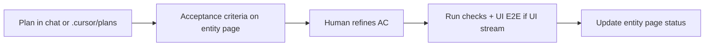

# UI verification and E2E (Cursor harness)

How to verify UI-modifying work in this workspace **without** a pipeline `40-verify` stage.

## Flow

1. Scope work to a Jira slug (e.g. `flpath-4164`) and an entity page under `wiki/entities/`.
2. Draft acceptance criteria on that entity page (or in `.cursor/plans/<scope>.plan.md`); human refines in chat.
3. **Only after confirmation** — run automated checks and, for UI streams, exercise the app end-to-end.
4. Record pass/fail and evidence on the **entity page** (implementation status table, verification bullets).

## UI-modifying streams

**Yes** when any: edits in `koku-ui`, `sources-ui`, or `insights-rbac-ui`; frontend paths (`*.tsx`, routes, components); plan explicitly targets in-browser behavior.

**E2E means:** full user path (login → navigate → act → visible outcome), not unit tests alone. Use Cypress/Playwright when the submodule documents them; otherwise documented manual steps with URL and evidence.

**On-prem live Cypress (`koku-ui-onprem/cypress/e2e/live/`):** local-only via `test:cypress:live` after `start:onprem:dev` — **not** a CI gate. See [onprem-playwright-e2e.md](onprem-playwright-e2e.md).

## Non-code / Jira-only streams

Define criteria against Jira/plan on the entity page; skip UI exercise; evidence from Jira state, comments, and checklist.

## Status

Read `wiki/entities/<ticket>.md` + `git submodule status` for stream progress. No `@rpi-status` trigger on this branch.
